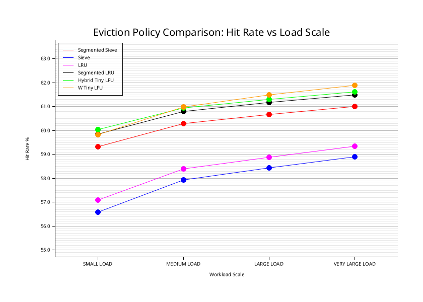
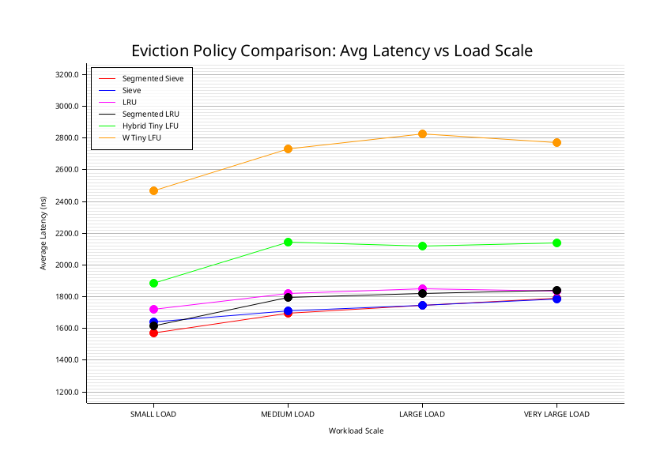
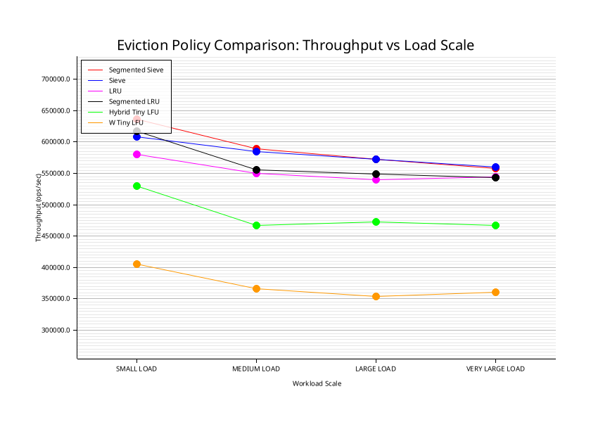

# A Performance-Oriented Comparison of Cache Eviction Algorithms

**Introduction**

In this document, we perform a detailed analysis of several major cache eviction algorithms. The choice of an eviction algorithm should be driven not only by the eviction policy it uses, but also by its runtime characteristics, especially throughput and latency.

In practical terms, a good eviction algorithm should provide a reasonable hit rate without causing latency to grow uncontrollably. This becomes especially important in high-performance systems, where even occasional latency spikes can significantly impact latency and degrade the overall performance of the system using the cache.

**Traffic Pattern**

A realistic simulation of web-based traffic often follows a Zipfian access pattern, where a small fraction of the data receives a disproportionately large share of the requests. In practical terms, this is commonly observed as an 80/20 distribution, where roughly 20% of the keys account for around 80% of the traffic.

For this comparison, we generate the workload using a Zipfian distribution to better model real-world cache access behavior.

**Load Pattern**

To obtain meaningful results and understand how the eviction algorithms behave under different load conditions, we generate four workload categories: Small, Medium, Large, and Very Large.

Each category varies by key count, total number of operations, cache capacity, and eviction budget.

| Name | Key Count | Total Ops | Cache Capacity | Eviction Budget |
| :---- | :---- | :---- | :---- | :---- |
| Small | 1,000,000 | 10,000,000 | 250,000 | 1 |
| Medium | 5,000,000 | 50,000,000 | 1,250,000 | 1 |
| Large | 10,000,000 | 100,000,000 | 2,500,000 | 1 |
| Very Large | 20,000,000 | 200,000,000 | 5,000,000 | 1 |

Zipf Alpha: 1.03

Read:Write: 70:30

**Implementation & Environment Details**

All eviction algorithms used in this comparison were implemented in Rust. Rust was chosen because it provides low-level performance and memory control while maintaining strong safety guarantees, making it well-suited for implementing and benchmarking cache eviction logic.

The source code is available at:

[https://github.com/somesh-m/eviction-comparison](https://github.com/somesh-m/eviction-comparison)

Rust Version: rustc 1.95.0

CPU: AMD Ryzen 7 7700X 8-Core Processor

RAM: 32 GB

Steps to run the comparison

cargo run --bin compare

**Algorithms**

For the sake of this document we have considered the following algorithms.

1. Segmented Admission Control & Sieve Eviction
2. Sieve Eviction
3. Least Recently Used (LRU)
4. Segmented LRU
5. Hybrid Tiny LFU
6. W-Tiny LFU

**Segmented Admission Control & Sieve Eviction**

Segmented Admission Control with Sieve Eviction is a modified form of Segmented LRU. Instead of using LRU for both segments, this design uses a probationary segment for admission control and a protected segment that applies Sieve-based eviction.

In the current implementation, newly inserted keys are first placed in the probationary segment, which is implemented as a circular buffer. As the buffer fills up, older entries are overwritten. When a key in the probationary segment is accessed again through a GET or UPDATE, it is promoted to the protected segment.

The protected segment is intended to hold keys that have demonstrated reuse. Under memory pressure, this segment uses the Sieve eviction algorithm to identify and evict candidates efficiently.

The probationary segment can also be modified to use a lookahead-based eviction strategy. In that approach, eviction can be triggered ahead of the current insertion point to proactively free space. This may slightly reduce the hit rate, since some keys may be removed earlier than they would be in a simple circular-buffer design. However, throughput and latency are expected to remain largely similar because the eviction path remains lightweight and bounded.

This type of eviction strategy is especially useful for Zipfian or 80/20 workloads, where a small fraction of keys accounts for the majority of accesses. The probationary segment filters out one-time or low-frequency keys, while the protected Sieve segment retains frequently reused keys with low eviction overhead.

### **Sieve Eviction**

Sieve is a lightweight eviction algorithm that uses a visited bit and a moving hand pointer to efficiently identify eviction candidates. It aims to provide good cache hit rates while keeping eviction overhead low.

### **Least Recently Used (LRU)**

LRU evicts the item that has not been accessed for the longest time. It is simple and intuitive, but maintaining exact recency order can introduce overhead in high-throughput systems.

### **Segmented LRU**

Segmented LRU divides the cache into multiple segments, commonly probationary and protected, to distinguish newly inserted items from items that have demonstrated reuse. This helps reduce cache pollution from one-time accesses.

**Hybrid Tiny LFU**

This algorithm is similar to Segmented Sieve Eviction, but adds a frequency-aware admission mechanism using a Count-Min Sketch. New keys are first inserted into a probationary segment, implemented as a circular buffer, where they are allowed to accumulate access history before being considered for promotion.

When a key in the probationary segment is accessed again, it becomes a candidate for promotion to the protected segment. If space is available in the protected segment, the key is promoted directly. If the protected segment is full and replacement is required, the algorithm compares the candidate’s estimated frequency with the frequency of the key at the current protected hand position.

If the candidate has a lower estimated frequency, it remains in the probationary segment and gets another opportunity to demonstrate reuse. If the candidate has a higher estimated frequency, it is promoted to the protected segment, while the displaced protected key is demoted back into probation.

This allows the cache to preserve genuinely hot items while avoiding premature promotion or eviction decisions based purely on recency. By combining segmented admission control and approximate frequency tracking, the algorithm is better suited for workloads where access frequency is a stronger signal than recency alone.

### **W-TinyLFU**

W-TinyLFU combines a small admission window with frequency-based admission using approximate frequency tracking. It is designed to improve cache efficiency by admitting items that are likely to be reused while filtering out low-value entries.

### **The Core Difference: Hybrid TinyLFU vs. W-TinyLFU**

While both algorithms use a Count-Min Sketch to track item frequency, they handle new arrivals and structural layout quite differently. Hybrid TinyLFU forces all new items immediately into a probationary circular buffer. To earn a spot in the protected main cache, an item must be re-accessed while in probation; if the protected segment is full, the candidate must win a direct "frequency duel" against the item currently at the protected hand position. This design is highly optimized for workloads where long-term access frequency is the clearest signal of value.

In contrast, W-TinyLFU introduces a dedicated "Window" cache (typically an LRU buffer) at the very front of the system. New items enter this window automatically, allowing the cache to seamlessly absorb sudden bursts of high-recency traffic. The frequency-based admission filter only kicks in when an item is evicted out of this window. At that point, the evicted item enters an admission duel against the eviction candidate of the main cache. By decoupling immediate recency (handled by the window) from long-term frequency (handled by the main cache), W-TinyLFU is much better suited for mixed workloads that experience volatile shifts in data access patterns.

### **Experimental Evaluation & Execution Analysis**

### To evaluate the operational efficiency of each eviction framework, we subjected the implementation candidates to identical workloads scaled across four distinct volume profiles: SMALL, MEDIUM, LARGE, and VERY LARGE.

### For all segmented variants (Segmented Sieve, Segmented LRU, and Hybrid TinyLFU), the protected partition size was configured at 65% of total cache capacity. This exact ratio was derived empirically through iterative optimization sweeps evaluating maximum global hit ratios across various pool configurations.

**Performance Summary (Medium Workload Baseline)**

The following matrix isolates performance metrics under a standardized medium workload. This provides a direct comparison of hit rate efficiency against hardware throughput and operational latency overhead.

| Algorithm | Hit Rate(%) | Throughput (QPS) | Latency (us) |
| :---- | :---- | :---- | :---- |
| Segmented Sieve | 60.30 | 589140.42 | 1.70 |
| Segmented LRU | 60.80 | 556203.44  | 1.80 |
| Hybrid Tiny LFU | 60.94 | 466837.33 | 2.14 |
| W Tiny LFU | 60.98 | 365909.88  | 2.73 |

**Key Architectural Takeaways**

While W-TinyLFU and Hybrid TinyLFU capture a marginally higher raw hit ratio, they introduce substantial operational penalties in high-performance configurations:

1. Throughput Amplification: Segmented Sieve achieves 61% higher throughput compared to traditional W-TinyLFU. This behavior is driven by the algorithmic simplicity of the Sieve pointer, which replaces expensive pointer mutations and probabilistic hashing loops with a flat cache structure and transient bit flips.

2. Latency Efficiency: Segmented Sieve reduces average transaction latency down to 1.70 (a 37.7% reduction compared to W-TinyLFU). In event-driven, thread-per-core systems, this optimization directly prevents execution loop stalling, keeping high-throughput latencies predictably low.

**Comprehensive Evaluation Data**

The complete empirical matrix across all execution loads is recorded below:

| Algorithm | Workload | Hit Rate (%) | Run Time (ms) | Throughput (QPS) | Avg Latency (us) |
| :-- | :-- | --: | --: | --: | --: |
| Segmented Sieve | SMALL LOAD | 59.32 | 15707.47 | 636639.62 | 1.57 |
| Segmented Sieve | MEDIUM LOAD | 60.30 | 84869.41 | 589140.42 | 1.70 |
| Segmented Sieve | LARGE LOAD | 60.67 | 174766.60 | 572191.72 | 1.75 |
| Segmented Sieve | V.LARGE LOAD | 61.02 | 358597.85 | 557727.82 | 1.79 |
| Sieve | SMALL LOAD | 56.58 | 16422.61 | 608916.46 | 1.64 |
| Sieve | MEDIUM LOAD | 57.93 | 85497.41 | 584813.03 | 1.71 |
| Sieve | LARGE LOAD | 58.43 | 174780.47 | 572146.31 | 1.75 |
| Sieve | V.LARGE LOAD | 58.90 | 356765.51 | 560592.31 | 1.78 |
| LRU | SMALL LOAD | 57.10 | 17223.55 | 580600.25 | 1.72 |
| LRU | MEDIUM LOAD | 58.39 | 90935.55 | 549839.99 | 1.82 |
| LRU | LARGE LOAD | 58.89 | 185017.44 | 540489.58 | 1.85 |
| LRU | V.LARGE LOAD | 59.34 | 367584.91 | 544091.97 | 1.84 |
| Segmented LRU | SMALL LOAD | 59.86 | 16187.87 | 617746.48 | 1.62 |
| Segmented LRU | MEDIUM LOAD | 60.80 | 89895.16 | 556203.44 | 1.80 |
| Segmented LRU | LARGE LOAD | 61.17 | 182117.18 | 549097.03 | 1.82 |
| Segmented LRU | V.LARGE LOAD | 61.50 | 367832.33 | 543726.00 | 1.84 |
| Hybrid Tiny LFU | SMALL LOAD | 60.03 | 18872.42 | 529873.79 | 1.89 |
| Hybrid Tiny LFU | MEDIUM LOAD | 60.94 | 107103.69 | 466837.33 | 2.14 |
| Hybrid Tiny LFU | LARGE LOAD | 61.30 | 211736.40 | 472285.34 | 2.12 |
| Hybrid Tiny LFU | V.LARGE LOAD | 61.62 | 427648.50 | 467673.81 | 2.14 |
| W Tiny LFU | SMALL LOAD | 59.84 | 24658.35 | 405542.08 | 2.47 |
| W Tiny LFU | MEDIUM LOAD | 60.98 | 136645.67 | 365909.88 | 2.73 |
| W Tiny LFU | LARGE LOAD | 61.50 | 282737.91 | 353684.44 | 2.83 |
| W Tiny LFU | V.LARGE LOAD | 61.90 | 553949.31 | 361043.86 | 2.77 |

## **Conclusion**

The benchmark results show that the highest hit rate does not always translate into the best overall cache behavior. W-TinyLFU and Hybrid TinyLFU achieve marginally better hit rates, but they also introduce additional runtime overhead due to frequency estimation and admission-control logic.

Segmented Sieve provides a more balanced tradeoff. It delivers competitive hit rates while maintaining higher throughput and lower average latency across the evaluated workloads. This makes it especially attractive for high-performance, event-driven cache systems where eviction logic must remain lightweight and predictable.

For systems where every percentage point of hit rate is critical, frequency-aware algorithms may still be preferable. However, for latency-sensitive cache engines, Segmented Sieve appears to offer a practical balance between hit-rate efficiency and operational performance.
